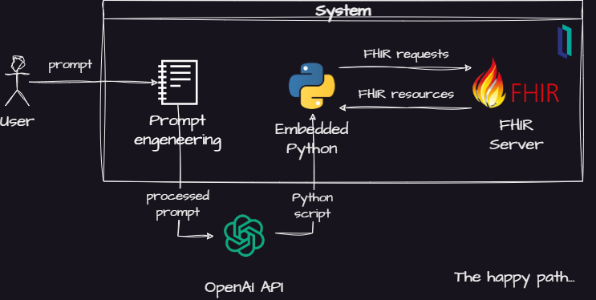
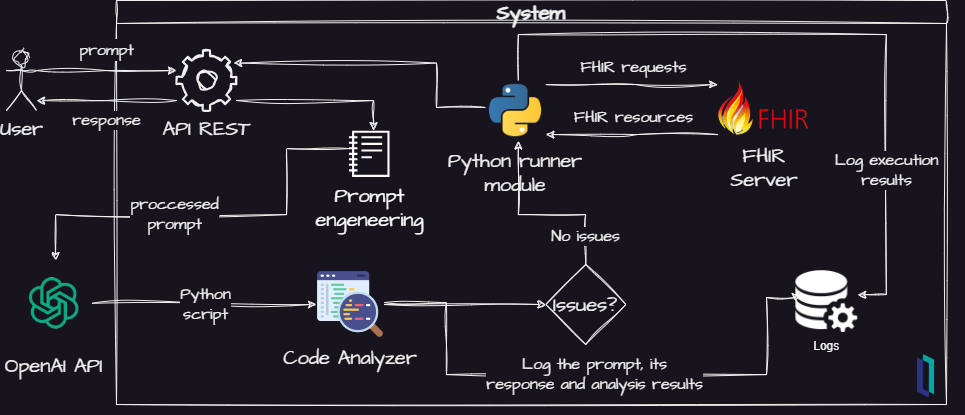

 [](https://openexchange.intersystems.com/package/iris-fhir-generative-ai)
 [](https://community.objectscriptquality.com/dashboard?id=intersystems_iris_community%2Firis-fhir-generative-ai)
 [](https://community.objectscriptquality.com/dashboard?id=intersystems_iris_community%2Firis-fhir-generative-ai)

# iris-fhir-generative-ai

An experiment to use generative AI and FHIR to answer healthcare domain questions on the InterSystems IRIS.

[](https://www.youtube.com/watch?v=WDTG5_SVvTg)

> **Disclaimer: This is an experimental project. It'll send data to OpenAI API and execute code generated by AI on your system. So, don't use it on sensible data and/or production systems. Also note that as OpenAI API calls are charged. Use it on your own risk. It is not a production ready project.**

## Description

This project is an experiment to use OpenAI API to answer to user prompts in the healthcare domain using FHIR resources and Python code.

## Project idea

Generative AIs, like the [LLM models available on OpenAI](https://platform.openai.com/docs/models), has been demonstrated remarkable power to understand and answer high level questions. They use huge amounts of data to train their models, so they can answer complex questions.

They can even [use programming languages to create code based on prompts](https://platform.openai.com/examples?category=code) - and I have to confess that the idea of getting my work automated causes me some anxiety. But so far, seems like that it's something that people must to get used to, like it or not. So I decided to do some tries.

The main idea of this project came when I read [this article](https://the-decoder.com/chatgpt-programs-ar-app-using-only-natural-language-chatarkit/) about the [ChatARKit project](https://github.com/trzy/ChatARKit). This project uses OpenAI APIs to interpret voice commands to render 3D objects in live video from smartphones cameras - very cool project. And seems like this is a hot topic, as I found a recent [paper](https://dl.acm.org/doi/pdf/10.1145/3581791.3597296) following a similar idea.

What make me most courious about it was the use of ChatGPT to **programming** an AR application. As a open github repo was available, I searched into it and found [how the author used ChatGPT to generate code](https://github.com/trzy/ChatARKit/blob/master/iOS/ChatARKit/ChatARKit/Engine/ChatGPT.swift). Later, I found that this kind of techinique is called *prompt engeneering* - [here is a Wikipedia article about it](https://en.wikipedia.org/wiki/Prompt_engineering), or these two more practical references: [1](https://microsoft.github.io/prompt-engineering/) and [2](https://learn.microsoft.com/en-us/azure/cognitive-services/openai/concepts/advanced-prompt-engineering?pivots=programming-language-chat-completions).

So, I thought - why if I try something similar, but using FHIR and Python? Here is what I came up with:



<b>Fig.1 - Project basic idea</b>

Its main elements are:

- A prompt engineering module which will instruct then AI model to use FHIR and Python
- An OpenAI API integration module
- A Python interpreter to execute the generated code
- A FHIR server to answer the queries generated by the AI model

The basic idea is use the [OpenAI Completion API](https://platform.openai.com/docs/api-reference/completions) to ask the AI to break down the question as a bunch of FHIR queries. Then, the AI model creates a Python script to handle the FHIR resources returned by the FHIR server in the InterSystems IRIS for Health.

If this simple design works, users would be allowed to get answers to questions that are not yet supported by the analytical models of applications. Futher, thoses questions answered by the AI model could be analyzed in order to discover new insights on users needs.

Another advantage of this design is the fact that you don't need to expose your data and schemas with an external API. For instance, you can ask question about patients without the need of sending patient data or schema of your database to the AI server. As the AI model only uses public available features - FHIR and Python in this case, you don't need to plublish internal data.

But, this design also leads to some questions like:

- How to guide the AI to use FHIR and Python according to the users needs?
- Are the answers generated by the AI model correct? Is it possible to have confidence in them?
- How to deal with security issues of running a Python code generated externally?

Thus, in order to build some support to these questions, I did some elaboration on the initial design and got this:



<b>Fig.2 - Project refined idea</b>

Now, some new elements was added to the project:

- A Python code analyzer to scan for security issues
- A logger to record important events for futher analysis
- An API REST for futher integrations

So, this project aims to be a proof of concept which can support experiments to gather information to try to answer those kind of questions.

In the next sections, you will find how to install the project and try it.

Then, you will see some results that I got trying to answer the questions above and some conclusions.

Hope you find it useful. And you are more than welcome to contribute to the project!

## Installation 

### Prerequisites

Make sure you have [git](https://git-scm.com/book/en/v2/Getting-Started-Installing-Git) and [Docker desktop](https://www.docker.com/products/docker-desktop) installed.

You also must have an OpenAI API key.

### Docker

Clone/git pull the repo into any local directory

```bash
git clone https://github.com/jrpereirajr/iris-fhir-generative-ai-ai.git
```

Open the terminal in this directory and run the following.

In order to run this project, you need to have a OpenAI API key. So, set an environment called `OPENAI_API_KEY` variable with its value:

For Linux:
```bash
export OPENAI_API_KEY=your_api_key_here
```

For Windows (MS DOS):
```bat
set OPENAI_API_KEY=your_api_key_here
```

For Windows (PowerShell):
```PowerShell
$env:OPENAI_API_KEY = "your_api_key_here"
```

Next, build and run the project image.

For Linux:
```bash
docker-compose build --build-arg OPENAI_API_KEY=$OPENAI_API_KEY
docker-compose up -d
```

For Windows (MS DOS):
```bat
docker-compose build --build-arg OPENAI_API_KEY=%OPENAI_API_KEY%
docker-compose up -d
```

For Windows (PowerShell):
```powershell
docker-compose build --build-arg OPENAI_API_KEY=$env:OPENAI_API_KEY
docker-compose up -d
```

## Trying the project

You can try the project by running it directly in the terminal, by using an REST API, or using an chat UI.

Follow the instructions below to know how to try each one of them.

### In terminal

To try it, open an IRIS terminal and run the following:

```objectscript
ZN "USER"
Do ##class(fhirgenerativeai.FHIRGenerativeAIService).RunInTerminal("<your prompt>")
```

For instace, the following questions was used to test the project:

1. How many patients are in the dataset?
2. What is the average age of patients?
3. Give me all conditions (code and name) removing duplications. Present the result in a table format. (Don't use pandas)
4. How many patients has the condition viral sinusitis (code 444814009)?
5. What is the prevalence of viral sinusitis (code 444814009) in the patient population? For patients with the same condition multiple times, consider just one hit to your calculations.
6. Among patients with viral sinusitis (code 444814009), what is the distribution of gender groups?

You can found output examples for those questions [here](misc/tests-accuacy).

> Please, note that if you try that on your system results may be different, even if you use the same prompt. This is due the stochastic nature of LLM models.

Those questions was suggested by ChatGPT. It was asked that the questions was created by a way which the level of complexity was increasing. The exception was the 3rd question, that was proposed by the author.

### By a REST API

Two endpoints are available (formating in markdown inspiration [here](https://gist.github.com/azagniotov/a4b16faf0febd12efbc6c3d7370383a6)):

<details>

<summary><code>POST</code> <code><b>/get-answer</b></code></summary>

Retrieves an answer from the FHIRGenerativeAIService.

##### Parameters

> | name           |  type     | data type      | description                                                           |
> |----------------|-----------|----------------|-----------------------------------------------------------------------|
> | payload (body) |  required | object (JSON)  | A JSON object like this one: {"prompt": "<your prompt>"}              |

##### Responses

> | http code     | content-type              | response                                                            |
> |---------------|---------------------------|---------------------------------------------------------------------|
> | `200`         | `application/json`        | `Configuration created successfully`                                |

</details>

<details>

<summary><code>GET</code> <code><b>/log/{sessionId}</b></code></summary>

Returns details about an answer from the FHIRGenerativeAIService, identified by its sessionId. @param sessionId The sessionId of the answer to retrieve

##### Parameters

> | name           |  type     | data type      | description                                                           |
> |----------------|-----------|----------------|-----------------------------------------------------------------------|
> | sessionId      |  required | string         | The session ID of a previous answer.                                  |

##### Responses

> | http code     | content-type  | response                                              |
> |---------------|---------------|-------------------------------------------------------|
> | `200`         | `text/plain`  | The log of the answer.                                |

</details>

Also available as [Postman collection](misc/postman/iris-fhir-generative-ai.postman_collection.json) or [OpenAPI definition](http://localhost:32783/swagger-ui/index.html?url=http://localhost:32783/iris-fhir-generative-ai/api/_spec#/default/GetLog).


<b>Fig.3 - API in Postman</b>

### By a chat UI

You can try the project by using a chat UI. Its use s pretty straightforward: acess it [here](http://localhost:32783/iris-fhir-generative-ai/chat/FhirEasy_AI.html), type your prompt and hit enter.

The chat will present you the anwser and an explanation.


<b>Fig.4 - Chat UI</b>

## Prompt Engineering

The prompt used by the project can be found [here](/src/fhirgenerativeai/PromptService.cls) in the method `GetSystemTemplate()`.

It follows the guides of prompt engineering where first you assign a role to the AI model, and then enter a bunch of contraints and instructions. The intent of each of its section are commented, so you can understand how it works.

Note the use of a kind of interface definition when the model is instructed to assume a function already definied called `CallFHIR()` to interact with FHIR instead of declaring something by itself. This was inpired by the project ChatARKit where the author define a set of functions that abstracts complex behaviours for using a AR library.

Here I used this techinique to avoid the model to creating code to do HTTP calls directly.

An interesting finding here was about forcing the AI model to return its response in XML format. As Python code was intended to be returned, I formmated it in XML to use the CDATA block.

Despite beeing clear in the prompt that the response format must be in XML, the AI model just starts to follow this instruction after sending the user prompt in XML format as well. You can see that in the method `FormatUserPrompt()` in the same classe refreced above.

## Python code Analyzer

This module uses the [bandit library](https://bandit.readthedocs.io/en/latest/) to scan for security issues in the generated Python code.

This library generates the AST of a Python program and test it against common security issues. You can find the kind of issues are scanned in those links:
- [Test plugins](https://bandit.readthedocs.io/en/latest/plugins/index.html#complete-test-plugin-listing)
- [Calls blacklist](https://bandit.readthedocs.io/en/latest/blacklists/blacklist_calls.html)
- [Imports blacklist](https://bandit.readthedocs.io/en/latest/blacklists/blacklist_imports.html)

Each Python code returned by the AI model is scanned against those security issues. If something wrong is found, the execution is canceled and an error logged.

## Logger

All the events are logged for further analysis in the table [LogTable](src/fhirgenerativeai/LogTable.cls).

Each run to answer a question has a session ID. You can find it in the column 'SessionID' in the table and use it to get all events by passing it to the method `RunInTerminal("", <SessionID>)`. For instance:

```objectscript
Do ##class(fhirgenerativeai.FHIRGenerativeAIService).RunInTerminal("", "asdfghjk12345678")
```

You also can check all log events using this SQL:

```sql
SELECT *
FROM fhirgenerativeai.LogTable
order by id desc
```

## Tests

Some tests was executed to get information to measure the performance of the AI model.

Each test was performed 15 times and them outputs are stored in the [this](misc/tests-accuacy) and [this](misc/tests-security) direcotries.

> Please, note that if you try that on your system results may be different, even if you use the same prompt. This is due the stochastic nature of LLM models.

### Accuracy

For the test of the question #1, there were `14 results 6`, and `1 error`. The correct value is `6`. So it was `100%` correct, but had execution failed of `6%`.

SQL statement to validate the #1 result:

```sql
SELECT 
count(*)
FROM HSFHIR_X0001_S.Patient
```

For the test of the question #2, there were `3 results 52`, `6 results 52.5` and `6 errors`. The correct value - considering ages with decimal values, is `52.5`. So I consider both values as correct as this little difference probably is due an ambiguous prompt - it doesn't mention anything about allowing or not ages with decimal values. So it was `100%` correct, but had execution failed of `40%`.

SQL statement to validate the #2 result:

```sql
SELECT 
birthdate, DATEDIFF(yy,birthdate,current_date), avg(DATEDIFF(yy,birthdate,current_date))
FROM HSFHIR_X0001_S.Patient
```

For the test of the question #3, there were `3 error` and `12 tables with 23 rows`. The tables values was not in the same position and format, but again I've considered this due a malformed prompt. So it was `100%` correct, but had execution failed of `20%`.

SQL statement to validate the #3 result:

```sql
SELECT 
code, count(*)
FROM HSFHIR_X0001_S.Condition
group by code
```

For the test of the question #4, there were `2 errors`, `12 results 7` and `1 result 4`. The correct value is `4`. So it was `7%` correct, and had execution failed of `13%`.

SQL statement to validate the #4 result:

```sql
SELECT 
p.Key patient, count(c._id) qtde_conditions, list(c.code) conditions
FROM HSFHIR_X0001_S.Patient p
join HSFHIR_X0001_S.Condition c on c.patient = p.key 
where code like '%444814009%'
group by p.Key
```

For the test of the question #5, there were `11 errors`, `3 result 4` and `1 result 0.6`. The correct value is `4`. So it was `75%` correct, and had execution failed of `73%`.

The SQL used to validate the #5 result is the same used for the #4.

For the test of the question #6, there were `12 errors` and `3 result {female: 4, male: 2, other: 0}`. The correct value is `{female: 3, male: 1, other: 0}`. So it was `0%` correct, and had execution failed of `80%`.

SQL statement to validate the #6 result:
```sql
SELECT 
p.gender, count(distinct p._id) qty_patients, list(p.key) patients, list(c.code) conditions
FROM HSFHIR_X0001_S.Patient p
join HSFHIR_X0001_S.Condition c on c.patient = p.key 
where code like '%444814009%'
group by p.gender
```

Summarizing all results:

| Test # | Accuracy | Execution Failure |
|--------|----------|-------------------|
| 1      | 100%     | 6%                |
| 2      | 100%     | 40%               |
| 3      | 100%     | 20%               |
| 4      | 7%       | 13%               |
| 5      | 75 %     | 73%               |
| 6      | 0%       | 80%               |

### Security

As you can check in the codes generates in the [tests directory](misc/tests-accuacy), seems like no security issues was generated by the AI model - and that was the same result that the code analyzer module found, no security issues.

So, in order to test if the code analyzer was able to detect security issues, the [module that executes Python code](src/fhirgenerativeai/PythonService.cls) has a property called `CodeInjection` where malicious code can be injected in order to be tested.

So the following malicious codes were injected for security testing:

1. Security test #1:

```python
print(eval("os.chmod('%s', 0o777)" % 'test.txt'))
```

This code tries to access the OS filesystem and change the permissions of a file. This is clearly a not expected code for the intent of the project, so it must be blocked.

2. Security test #2:

```python
import requests

url = "https://postman-echo.com/get"
params = {"arg": "value"}

response = requests.get(url, params=params)
data = response.json()

print(data)
```

This code tries to make a HTTP request to an external address - the Postman API in this case. If this code is executed, local information could be easyly accessed by attackers.

As you can see in the [directory for security tests](misc/tests-security), the code analyzer found the security issues successfully.

## Conclusions

For accuracy, the AI model get correct results for the questions of low complexity, but starts to fail as the question complexity increases. The same was observed for failures in execution. So, as more complex are the questions, more the AI model generates code that won't execute and with more probability to lead to wrong results.

This means that some efforts need to be made to the prompt. For instance, in the [code of question #6](misc/tests-accuacy/6/1688265739062.txt), the error was quering just patients and ignoring the conditions. This kind of analysis is necessary to guide changes in the prompt.

In general, the performance of the AI model in this tests shows that it still need more improvement before being able to answer analytical questions. 

This is due the stochastic nature of the AI model. I mean, in the ChatARKit project cited above, if the AI model renders a 3D object not exactly in the place requested but near of it, probably the user will not mind it. Unfortunately, the same situation is not true to analytical questions, the answers need to be exact.

But, it's important to note that I am not saying that AI models can't perform such tasks. What I'm saying is that the design used in this project needs improvement.

Important to note that this project did not used more advanced techniques to use generatives AIs, like [Langchain](https://python.langchain.com/docs/get_started/introduction.html) and [AutoGPT](https://autogpt.net/autogpt-installation-and-features/). Here a more "pure" approach was used; perhaps using such more sophisticated tools could be lead to better results.

Regarding security, the code analyzer found all security issues tested.

However, this does not mean that the code gnerated by AI model is 100% secure. Futhermore, allowing execution of Python code generated externally may be definitely dangerous. You even can't say with 100% sure that the system that is giving the Python code is actually the OpenAI API server...

A better way to avoid security issues may be try other languages less powerful than Python, or try to create you own "language" and present it to the AI model, like in [this very simple example](https://platform.openai.com/examples/default-text-to-command).

Finally, it's important to note that aspects like code performance was not covered in this project and probably will be a good subject for a future work as well.

So, I hope you found this project interesting and useful.

## Team

* [Henrique Dias](https://community.intersystems.com/user/henrique-dias-2)
* [Henry Pereira](https://community.intersystems.com/user/henry-pereira)
* [José Roberto Pereira](https://community.intersystems.com/user/jos%C3%A9-roberto-pereira-0)
